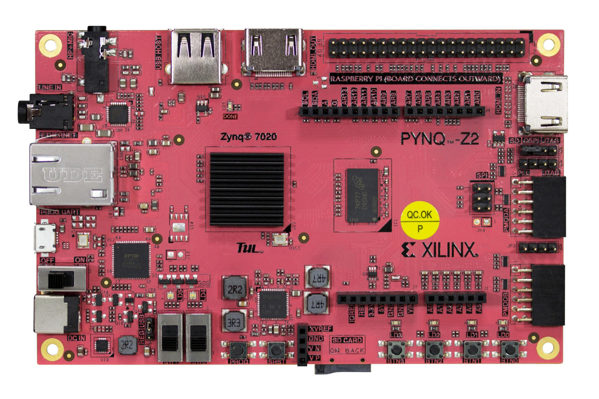

# 🚀 FPGA Challenge 2025 - Qualifying Round

Welcome to the **FPGA Challenge 2025 Qualifying Round**! This competition challenges participants to optimize machine learning models for FPGA deployment using **HLS4ML**. Your goal is to design efficient models that maximize accuracy while minimizing hardware resource usage and latency.

---

## 🛠 Challenge Overview

- Develop and optimize machine learning models for FPGA implementation.
- Compete across two tasks: **Image Classification (CIFAR-10)** and **Anomaly Detection (ToyCar)**.
- Evaluate model accuracy, FPGA resource usage, and inference latency.

---

## 📊 Performance Scoring System and Dataset

You can access detailed information about the scoring system and datasets for both tasks via the following links:

- 🖼️ **[Image Classification Task - Kaggle Page](#)** - Coming Soon  
- 🚨 **[Anomaly Detection Task - Kaggle Page](#)**  - Coming Soon

---

## **Competition Environment Requirements**
- **FPGA Model:** **PYNQ-Z2**

- **HLS Tool Version:** Xilinx Vitis HLS 2024.2  
  - **HLS Tool Installation Guide:** Coming Soon  

---

### **Scoring Criteria**
Your final score will be based on three key factors:  
- **Accuracy**: Evaluated using the Kaggle competition test set.  
- **HLS Synthesis Results**:  
  - **C Synthesis Results**:  
    - **Resource Usage**: FPGA resource utilization including LUTs, DSPs, and BRAMs.  
    - **Latency**: Measured in seconds.
